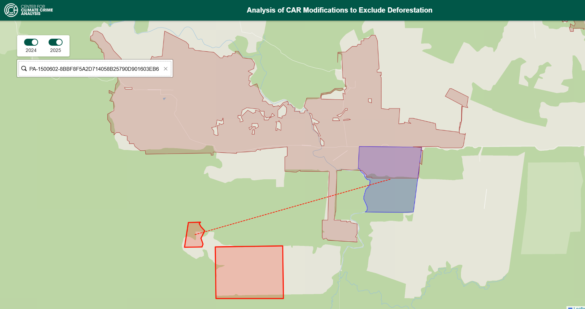

# CCCA – Client-Facing Pipeline

A fully automated pipeline for analyzing changes in rural property boundaries (CARs) and their relationship to deforestation alerts (PRODES) in Brazil. The workflow is user-friendly and reproducible, requiring minimal manual intervention. All major steps are orchestrated by a single shell script (`run_pipeline.sh`), which guides the user through data selection, ingestion, processing, and visualization.

---



## 📋 Table of Contents

1. [Prerequisites](#1-prerequisites)
2. [Setup Instructions](#2-setup-instructions)
    - [Install Python, pip, and virtualenv](#21-install-python-pip-and-virtualenv)
    - [Clone the Repository](#22-clone-the-repository)
    - [Set Up a Virtual Environment](#23-set-up-a-virtual-environment)
    - [Install Dependencies](#24-install-dependencies)
    - [Install Tesseract OCR](#25-install-tesseract-ocr)
3. [SICAR Data Folder Structure & Assumptions](#3-sicar-data-folder-structure--assumptions)
4. [Using Your Own Data](#4-using-your-own-data)
5. [Running the Pipeline](#5-running-the-pipeline)
6. [Workflow Overview](#6-workflow-overview)
7. [Key Files](#7-key-files)
8. [Output](#8-output)
9. [Notes & Known Challenges](#9-notes--known-challenges)
10. [To Install a New Python Package](#-to-install-a-new-python-package)

---

## 1. Prerequisites

- Python 3.10+
- pip
- virtualenv

---

## 2. Setup Instructions

### 2.1. Install Python, pip, and virtualenv

On Ubuntu/Debian:

```bash
sudo apt install python3 python3-pip virtualenv
```

### 2.2. Clone the Repository

```bash
git clone <repo_url>
cd CCCA_CAR_Analysis
git checkout -b <branch_name>
```

### 2.3. Set Up a Virtual Environment

```bash
python3 -m venv myenv
source myenv/bin/activate
```

### 2.4. Install Dependencies

```bash
pip install -r requirements.txt
```

### 2.5. Install Tesseract OCR

Some scripts require [Tesseract OCR](https://github.com/tesseract-ocr/tesseract) for text extraction.  
You must install both the Python package and the system dependency:

```bash
pip install pytesseract
```

On Ubuntu/Debian, also run:

```bash
sudo apt-get install tesseract-ocr
```

For other operating systems, see the [Tesseract installation instructions](https://github.com/tesseract-ocr/tesseract).

---

## 3. SICAR Data Folder Structure & Assumptions

- **For 2024 and prior years:**  
  It is assumed that you will provide your own SICAR (CAR) data and place it in the appropriate folder:  
  `data/SICAR/<year>/`  
  For example, for 2022, place your CAR shapefiles or GeoPackages in `data/SICAR/2022/`.

- **For the latest year (e.g., 2025):**  
  The pipeline uses the SICAR API to download the most recent data.  
  **Important:** The downloaded data will be organized by state, so the folder structure must be:  
  `data/SICAR/2025/<state>/`  
  Each state subdirectory should contain the shapefiles for that state.  
  This structure is required for the pipeline to correctly process the latest year.

---

## 4. Using Your Own Data

You can manually upload your own datasets for analysis:

- **PRODES Data:**  
  Place your own PRODES deforestation data (as a GeoJSON, Shapefile, or GeoPackage) in the `data/PRODES/` folder.  
  If you use a different filename or format, adjust the ingestion scripts or rename your file to match the expected input.

- **SICAR (CAR) Data:**  
  Place your own SICAR (CAR) data for any year in the corresponding folder:  
  `data/SICAR/<year>/`  
  For example, if you have CAR data for 2022, put it in `data/SICAR/2022/`.  
  The folder should contain the shapefile or GeoPackage for that year.

  For the **latest year** (e.g., 2025), the folder must be structured as:  
  `data/SICAR/2025/<state>/`  
  with each state subdirectory containing the relevant shapefiles.

When you run the pipeline, it will automatically detect and use any data you have placed in these folders, as long as the folder structure and file formats are correct.

---

## 5. Running the Pipeline

To run the entire workflow, use:

```bash
bash run_pipeline.sh
```

This command will guide you through the full workflow, from data download to interactive map visualization.

---

## 6. Workflow Overview

When you run `bash run_pipeline.sh`, the following steps occur:

1. **User Input:**  
   - You are prompted to enter two years for analysis (e.g., 2024 and 2025).

2. **Data Checks & Download:**  
   - The script checks for the existence of SICAR data folders for the selected years and the latest available year.
   - If missing, it downloads and unzips the required SICAR and PRODES datasets, or prompts you to add your own data.

3. **Data Processing:**  
   - The main Python script (`data_processing/data_processing.py`) is run with the selected years as arguments.
   - This script:
     - Standardizes and merges CAR data for the selected years.
     - Filters for valid rural properties.
     - Intersects CARs with PRODES deforestation polygons.
     - Identifies parcels whose boundaries changed and no longer intersect PRODES.
     - Calculates geodesic distances between old and new boundaries.
     - Exports results as GeoJSON files.

4. **Webmap Preparation:**  
   - The latest output GeoJSON files are copied to `webmap/data/`.
   - A `config.json` file is generated in `webmap/data/` to record which years were analyzed.

5. **Visualization:**  
   - The Leaflet web map (`webmap/CCCA-webmap.html`) is ready to use. It automatically loads the correct data and years for interactive exploration, search, and inspection.

---

## 7. Key Files

| File/Folder | Description |
|-------------|-------------|
| `run_pipeline.sh` | Main shell script that automates the entire workflow: prompts, downloads, processing, and export. |
| `data_ingestion/ingest_latest_car_data.py` | Downloads and processes SICAR (CAR) shapefiles for each year. |
| `data_ingestion/ingest_prodes_data.py` | Downloads the latest PRODES deforestation data. |
| `data_processing/data_processing.py` | Cleans, standardizes, and analyzes CAR and PRODES data; exports results. |
| `data_processing/standardize_data.py` | Helper functions for harmonizing CAR data columns and geometry. |
| `webmap/CCCA-webmap.html` | Interactive Leaflet map for exploring results. Loads data/config automatically. |
| `webmap/data/` | Contains the latest GeoJSON outputs and `config.json` for the web map. |

---

## 8. Output

After running the pipeline, you will find:

- GeoJSON files for each geometry type in `webmap/data/` (e.g., `geometry_2024.geojson`, `geometry_2025.geojson`, `geometry_prodes.geojson`, `distance_lines.geojson`)
- A `config.json` file in `webmap/data/` specifying the years analyzed
- An interactive web map at `webmap/CCCA-webmap.html` for exploring and searching the results

---

## 9. Notes & Known Challenges

- **Column name mismatches** across years are handled automatically during preprocessing.
- **CRS is kept as EPSG:4674** (geographic) for geodesic distance calculations.
- **Performance:** For very large datasets, some spatial operations may take several minutes.
- **Webmap:** Always loads the most recent analysis results; no manual editing required.

---

## ✅ To Install a New Python Package

```bash
pip install <package_name>
pip freeze > requirements.txt
```

---
